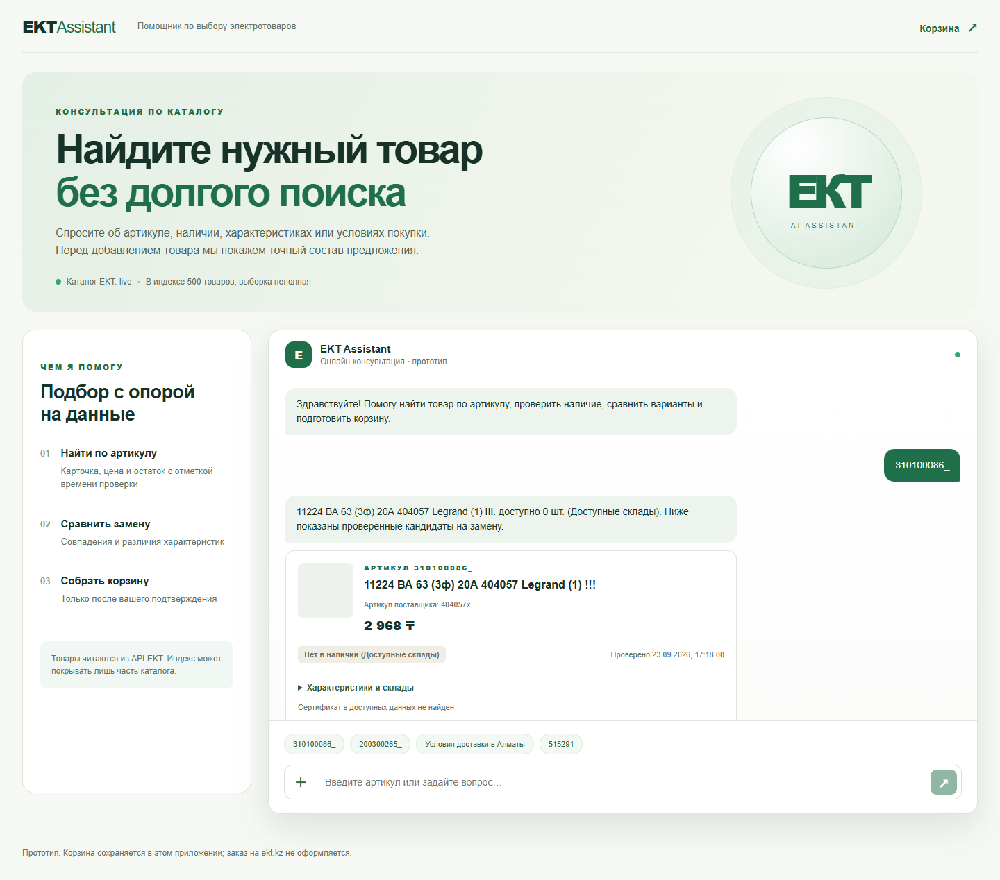

# EKT Assistant

Прототип консультанта для покупателя электротоваров EKT. Он находит товар по артикулу в каталоге, показывает характеристики, цену, наличие, источник и время проверки, отвечает об оплате и доставке, ищет строго сопоставленные аналоги и готовит корзину после явного подтверждения.



[Мобильный экран live-сценария](docs/screenshot-live-mobile.png) · [Демонстрационный режим](docs/screenshot-desktop.png)

## Быстрый запуск

Требуется Node.js 20.9+ (проверено на 20.20) и npm. На Windows PowerShell:

```powershell
Copy-Item .env.example .env
npm ci
npm run catalog:sync
npm run dev
```

Откройте <http://localhost:3000>. По умолчанию `DATA_MODE=demo`: в этом режиме используются **синтетические** карточки `DEMO-AV16`, `DEMO-AV16-OLD`, `DEMO-AV25`. Их цены и остатки не относятся к магазину. Проверочный путь: найдите `DEMO-AV16`, нажмите «Подготовить предложение», затем «Подтвердить добавление» и откройте `/cart`. Для отсутствующего товара используйте `DEMO-AV16-OLD`.

Для реального каталога укажите в локальном `.env` значения `EKT_API_USERNAME`, `EKT_API_PASSWORD`, переключите `DATA_MODE=live`, затем повторите `npm run catalog:sync` и перезапустите приложение. Для AI и распознавания фото/сканов также нужны `OPENAI_API_KEY` и доступное имя модели в `OPENAI_MODEL`. Проверьте интеграции командой `npm run live:check`: она делает запросы к EKT и один настоящий цикл вызова инструмента OpenAI. `npm run analogs:discover` ищет в частичном индексе проверочную пару отсутствующего товара и доступного аналога; отсутствие результата честно сообщает о границе выборки. Проверенное в этом окружении значение `OPENAI_MODEL=gpt-6-sol`: [документация OpenAI](https://developers.openai.com/api/docs/models/gpt-6-sol) подтверждает Responses API, вызовы функций и входные изображения; доступность на другом аккаунте нужно проверить. Секреты отправляются только сервером, `.env` исключён из Git. Подписка Codex не заменяет ключ API. Если ключа модели нет, поиск по артикулу, условия покупки и корзина продолжают работать, а расширенная AI-консультация недоступна.

Альтернативный запуск после заполнения `.env`: `docker compose up --build`. Конфигурация последовательно синхронизирует каталог перед запуском сервера и хранит SQLite в отдельном томе `/app/storage`, не перекрывая демонстрационные fixtures. Для healthcheck задан стартовый период 10 минут, чтобы дать время синхронизации; его достаточность в контейнере не проверена. Статическая проверка Compose прошла; Docker Engine на машине разработки недоступен. Сборка образа, работа контейнера и сохранность корзины после рестарта пока не проверены.

## Возможности и границы

| Сценарий | Реализация |
|---|---|
| M1: информация и наличие | Серверный GET detail EKT в live, сохранение исходных полей и времени проверки; сертификат показывается лишь при наличии связанной ссылки в данных |
| M2: аналоги | Кандидаты из индекса, свежие детали, положительный остаток и совпадение критичных параметров; неизвестные/конфликтные параметры не объявляются совместимыми |
| M3: условия покупки | Ответы об оплате, доставке и неподтверждённой минимальной партии со [ссылкой на официальную страницу](https://ekt.kz/about/information/) |
| M4: добавление | Предложение хранится на сервере; только кнопка или однозначное «да, добавь» запускает перепроверку цены, остатка и транзакцию; повтор не дублирует позиции |
| M5: ссылка | `/cart` открывает сохранённую корзину текущей cookie-сессии после обновления страницы |

Корзина **собственная, серверная**. API корзины ekt.kz организаторами не предоставлен. Прототип не резервирует товар, не создаёт заказ и не записывает товары на ekt.kz. Наличие на момент GET не гарантирует продажу. Каждый пользователь получает случайную HttpOnly cookie; сервер проверяет Origin у запросов, меняющих состояние.

История чата и выбранный товар сохраняются для текущей сессии после перезагрузки. При переключении `DATA_MODE` локальные сессии, предложения, корзины и индекс очищаются, чтобы демонстрационные данные не попали в live-режим.

Каталог индексируется частично: начальный лимит `CATALOG_MAX_PAGES=25` ограничивает запросы, а не задаёт размер всего ассортимента. В проверке 23.09.2026 загружены 25 страниц и 500 карточек; это не полный каталог. `GET /api/health` показывает фактическое покрытие и режим. Ошибка или повтор страницы не считается доказательством конца каталога. Индекс служит для поиска; карточка и предложение перечитываются из detail. Синхронизация: `npm run catalog:sync`. Список API партнёра: `GET /api/products`, страницы с `?page=N`, `GET /api/products/detail?id=N` по HTTP Basic Auth. Доступ к API корзины, административным методам и поисковому endpoint партнёра не предполагается.

Поддерживаются `.xlsx`, `.xls`, `.docx`, текстовые `.pdf`, `.jpg`/`.jpeg`; скан PDF и фото отправляются модели для извлечения текста при настроенном OpenAI API. Каждая строка черновика остаётся видимой: пользователь исправляет артикул, количество и единицу, затем отдельно отмечает её как проверенную. В предложение входят только отмеченные строки с точным сопоставлением, целым положительным количеством и явной единицей «шт»; причины исключения остальных строк и состав предложения показаны до подтверждения. Подготовка предложения не меняет корзину. Старый `.doc` не поддерживается: сохраните его как DOCX или PDF. По умолчанию файл ограничен 10 МБ; превышение 100 строк, 5 листов Excel или 10 страниц PDF отклоняет документ целиком вместо молчаливого обрезания. Три реальных вызова OpenAI OCR успешно обработали синтетические JPEG и растровый PDF, включая неясную маркировку; фото клиента и сложные реальные документы не проверялись.

## Архитектура

Next.js 16, React 19, TypeScript, SQLite. Route Handlers работают в Node runtime. `src/lib/ekt.ts` изолирует Basic Auth и нормализацию, `catalog.ts` индексирует товары, `analogs.ts` сравнивает кандидатов, `cart.ts` задаёт интерфейс `CartAdapter` и реализацию `PrototypeCartAdapter`. `src/lib/openai.ts` вызывает Responses API с инструментами чтения и подготовки предложения; добавление в корзину не доступно модели как инструмент. Серверные API валидируют ID, количество и принадлежность предложения сессии. Данные загруженных файлов не попадают в `public/`; в БД хранится только сокращённый черновик артикула и количества без исходного текста файла, привязанный к сессии. Старые черновики удаляются по TTL при следующей загрузке.

Цена и остаток из демонстрационного каталога находятся в `data/fixtures/catalog.json` и помечены как синтетические. Официальные условия покупки проверены 23.09.2026; изменения на сайте требуют повторной проверки текста в `src/lib/policy.ts`. Семантика `KRATNOST_MIN`/`KRATNOST_MAKS`, доступность специальных складов и назначение `RECOMMEND` не подтверждены; код не использует их как автоматическое правило продажи или замены. Общий остаток не выдается за остаток конкретного города. При расхождении источников показывается ограничение или меньшее подтверждённое число.

## Проверки

```powershell
npm run typecheck
npm run lint
npm run test
npm run build
npm run live:check # при настроенном live .env
npm run catalog:sync
npm run analogs:discover
npm run dev
npm run smoke:live
npm run browser:live
node scripts/smoke-http.mjs # только в demo
node scripts/check-browser.mjs # только в demo
```

До параллельных изменений локально прошли typecheck, lint, 22 теста и production build. В live EKT вернул страницу из 20 товаров и детали; OpenAI `gpt-6-sol` вызвал серверный инструмент в отдельной проверке и в самом приложении. Частичный индекс: 500 товаров. Найдена реальная пара: отсутствующий `18157` (`310100086_`) → доступный `515262` (`200300265_`, 74 шт. при проверке); совпали 3 полюса, 20 А, 400 В, 4,5 кА и характеристика C. Сквозной HTTP-сценарий проверил предложение, отсутствие изменений до согласия, подтверждение, повтор, изоляцию сессий и удаление тестовой позиции. Браузерный сценарий в Edge проверил desktop и 390 px mobile, корзину и refresh.

В отдельных ветках после исправлений прошли: core — 86 тестов и demo HTTP; OCR — 48 тестов, production build, desktop/mobile и три реальных вызова OpenAI на синтетических файлах; сертификаты — 58 тестов и ограниченная проверка 23 реальных карточек; Docker — 22 теста, production build и статическая проверка Compose. После объединения выполнены `npm ci`, **148/148 тестов**, lint, typecheck и production build с отдельной demo-БД. Повторный `live:check` получил 20 товаров EKT и detail ID 45357; `gpt-6-sol` выполнил реальный вызов функции. Live health показал 500 проиндексированных товаров и готовность. `smoke:live` снова проверил пару `18157` → `515262` (0 → 74 шт.), чат, предложение, подтверждение, повтор, изоляцию сессий и очистку; `browser:live` прошёл на desktop и 390 px mobile с обновлением корзины. Интегрированный OCR-сценарий на отдельной demo-БД проверил в браузере подтверждение ровно двух вручную отмеченных строк и сохранение корзины после обновления на обоих размерах экрана. Новых платных OCR-вызовов при этом не было. Скриншоты находятся в `docs/`; браузерные скрипты используют установленный Microsoft Edge. Подробная [матрица приёмки](docs/acceptance.md) отделяет эти результаты от непроверенного Docker runtime, реального фото клиента и сертификата конкретного товара.

[Детальный отчёт интеграции](docs/reports/integration.md) фиксирует проверки объединённой версии и их ограничения.

## Известные ограничения

- Точный подбор аналогов поддерживает только товары с достаточными критичными характеристиками. В неполном live-индексе подходящего товара может не быть.
- Файлы со сложными таблицами, неоднозначными колонками и OCR требуют ручной проверки; нераспознанные строки остаются видимыми. Старый DOC не поддержан.
- В подтверждении поддерживаются штучные товары без вариантов (`offers`). Мерные товары и варианты требуют отдельной модели количества и выбора.
- В 23 проверенных карточках EKT с подробными данными ссылка на сертификат конкретного товара не подтверждена; отдельный публичный каталог сертификатов не устанавливает применимость документа к позиции. Ветка отображения проверена синтетическими данными.
- Для одного товара корзина консервативно отклоняет пересекающиеся области остатков (общий остаток, город, склад), когда доступное количество нельзя безопасно распределить; это не резервирование склада EKT.
- SQLite предполагает один сервер с постоянным диском; горизонтальное serverless-развёртывание не заявлено.
- Изменение количества в корзине перепроверяет текущую цену и остаток; при изменении данных нужно подготовить новое предложение в чате.

Следующий интеграционный шаг для партнёра — предоставить официальный API корзины и правила складов/единиц, после чего можно заменить `PrototypeCartAdapter` без перестройки чата.
