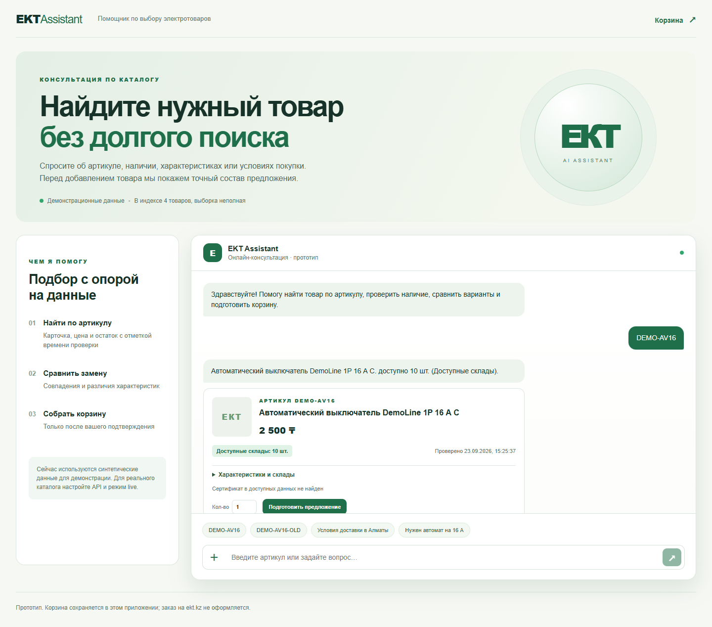

# EKT Assistant

Прототип консультанта для покупателя электротоваров EKT. Он находит товар по артикулу в каталоге, показывает характеристики, цену, наличие, источник и время проверки, отвечает об оплате и доставке, ищет строго сопоставленные аналоги и готовит корзину после явного подтверждения.



## Быстрый запуск

Требуется Node.js 20.9+ (проверено на 20.20) и npm. На Windows PowerShell:

```powershell
Copy-Item .env.example .env
npm ci
npm run catalog:sync
npm run dev
```

Откройте <http://localhost:3000>. По умолчанию `DATA_MODE=demo`: в этом режиме используются **синтетические** карточки `DEMO-AV16`, `DEMO-AV16-OLD`, `DEMO-AV25`. Их цены и остатки не относятся к магазину. Проверочный путь: найдите `DEMO-AV16`, нажмите «Подготовить предложение», затем «Подтвердить добавление» и откройте `/cart`. Для отсутствующего товара используйте `DEMO-AV16-OLD`.

Для реального каталога укажите в локальном `.env` значения `EKT_API_USERNAME`, `EKT_API_PASSWORD`, переключите `DATA_MODE=live`, затем повторите `npm run catalog:sync` и перезапустите приложение. Для AI и распознавания фото/сканов также нужны `OPENAI_API_KEY` и доступное имя модели в `OPENAI_MODEL`. Проверьте интеграции командой `npm run live:check`: она делает запросы к EKT и один настоящий цикл вызова инструмента OpenAI. Секреты отправляются только сервером, `.env` исключён из Git. Подписка Codex не заменяет ключ API. Если ключа модели нет, поиск по артикулу, условия покупки и корзина продолжают работать, а расширенная AI-консультация недоступна.

Альтернативный запуск после заполнения `.env`: `docker compose up --build`. Контейнер индексирует каталог при старте и хранит SQLite в постоянном томе. На машине разработки Docker Engine был недоступен, поэтому контейнерный запуск ещё не проверен.

## Возможности и границы

| Сценарий | Реализация |
|---|---|
| M1: информация и наличие | Серверный GET detail EKT в live, сохранение исходных полей и времени проверки; сертификат показывается лишь при наличии связанной ссылки в данных |
| M2: аналоги | Кандидаты из индекса, свежие детали, положительный остаток и совпадение критичных параметров; неизвестные/конфликтные параметры не объявляются совместимыми |
| M3: условия покупки | Ответы об оплате, доставке и неподтверждённой минимальной партии со [ссылкой на официальную страницу](https://ekt.kz/about/information/) |
| M4: добавление | Предложение хранится на сервере; только кнопка или однозначное «да, добавь» запускает перепроверку цены, остатка и транзакцию; повтор не дублирует позиции |
| M5: ссылка | `/cart` открывает сохранённую корзину текущей cookie-сессии после обновления страницы |

Корзина **собственная, серверная**. API корзины ekt.kz организаторами не предоставлен. Прототип не резервирует товар, не создаёт заказ и не записывает товары на ekt.kz. Наличие на момент GET не гарантирует продажу. Каждый пользователь получает случайную HttpOnly cookie; сервер проверяет Origin у запросов, меняющих состояние.

Каталог индексируется частично: начальный лимит `CATALOG_MAX_PAGES=25` ограничивает запросы, а не задаёт размер всего ассортимента. `GET /api/health` показывает фактическое покрытие и режим. Ошибка или повтор страницы не считается доказательством конца каталога. Индекс служит для поиска; карточка и предложение перечитываются из detail. Синхронизация: `npm run catalog:sync`. Список API партнёра: `GET /api/products`, страницы с `?page=N`, `GET /api/products/detail?id=N` по HTTP Basic Auth. Доступ к API корзины, административным методам и поисковому endpoint партнёра не предполагается.

Поддерживаются `.xlsx`, `.xls`, `.docx`, текстовые `.pdf`, `.jpg`/`.jpeg`; скан PDF и фото отправляются модели для извлечения текста при настроенном OpenAI API. Черновик можно исправить в интерфейсе; строки с точным артикулом и целым количеством переводятся в отдельное предложение, которое ещё нужно подтвердить. Старый `.doc` не поддерживается: сохраните его как DOCX или PDF. Качество OCR и обработка сложных таблиц пока не подтверждены на реальных файлах. Лимит файла по умолчанию 10 МБ, извлекается не более 100 строк и 10 страниц PDF.

## Архитектура

Next.js 16, React 19, TypeScript, SQLite. Route Handlers работают в Node runtime. `src/lib/ekt.ts` изолирует Basic Auth и нормализацию, `catalog.ts` индексирует товары, `analogs.ts` сравнивает кандидатов, `cart.ts` задаёт интерфейс `CartAdapter` и реализацию `PrototypeCartAdapter`. `src/lib/openai.ts` вызывает Responses API с read-инструментами; добавление в корзину не доступно модели как инструмент. Серверные API валидируют ID, количество и принадлежность предложения сессии. Данные загруженных файлов не попадают в `public/`; хранится только извлечённый черновик, привязанный к сессии, старые черновики удаляются по TTL при следующей загрузке.

Цена и остаток из демонстрационного каталога находятся в `data/fixtures/catalog.json` и помечены как синтетические. Официальные условия покупки проверены 23.09.2026; изменения на сайте требуют повторной проверки текста в `src/lib/policy.ts`. Семантика `KRATNOST_MIN`/`KRATNOST_MAKS`, доступность специальных складов и назначение `RECOMMEND` не подтверждены; код не использует их как автоматическое правило продажи или замены. Общий остаток не выдается за остаток конкретного города. При расхождении источников показывается ограничение или меньшее подтверждённое число.

## Проверки

```powershell
npm run typecheck
npm run test
npm run build
npm run live:check # только при настроенном live .env
npm run dev
node scripts/smoke-http.mjs
node scripts/check-browser.mjs
```

Локально пройдены typecheck, 19 тестов, production build, HTTP-сценарий поиска/чата/подтверждения, редактирования корзины и загрузки XLSX/PDF, а также браузерный сценарий в Edge на desktop и ширине 390 px. Скриншоты в `docs/`. `check-browser.mjs` использует установленный Microsoft Edge по стандартному Windows-пути. Подробная [матрица приёмки](docs/acceptance.md) отделяет demo от live. Live EKT API и реальный AI tool call пока не проверены: учётные данные и ключ не были доступны в рабочем окружении. После настройки `.env` нужно отдельно проверить их на свежих товарах и обновить [сценарий демонстрации](docs/demo.md).

## Известные ограничения

- Точный подбор аналогов поддерживает только товары с достаточными критичными характеристиками. В неполном live-индексе подходящего товара может не быть.
- Файлы со сложными таблицами, неоднозначными колонками и OCR требуют ручной проверки; нераспознанные строки остаются видимыми. Старый DOC не поддержан.
- В подтверждении поддерживаются штучные товары без вариантов (`offers`). Мерные товары и варианты требуют отдельной модели количества и выбора.
- По текущей выборке не подтверждена реальная ссылка на сертификат конкретного товара; ветка отображения проверена синтетическими данными.
- SQLite предполагает один сервер с постоянным диском; горизонтальное serverless-развёртывание не заявлено.
- Изменение количества в корзине перепроверяет текущую цену и остаток; при изменении данных нужно подготовить новое предложение в чате.

Следующий интеграционный шаг для партнёра — предоставить официальный API корзины и правила складов/единиц, после чего можно заменить `PrototypeCartAdapter` без перестройки чата.
